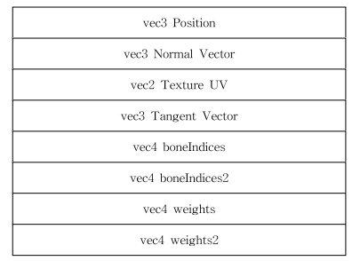
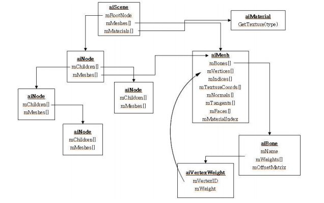
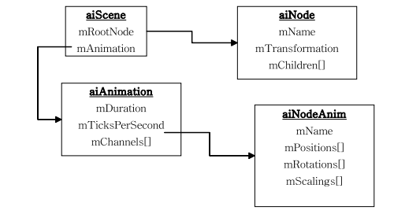

# AnimationFramework
> August 2019 Jeehon Hyun

FBX based animation framework developed in Visual Studio 2019. Useful for Computer Animation researchers.  
Used OpenGL 3.3, GLFW 3.3.6, Assimp 5.0.1, and GLAD.  
The only dependency of this repository is CMake.

* Features
Linear Blend Skinning
Normal mapping  
Smoothe shadows  
Object Selection  
Smoothe Animation  
OOP  

## Demo
https://www.youtube.com/watch?v=bEgeBJthBbI

## How to build and run.
1. Download this repository and go to the ```AnimationFramework/Build``` directory.
```
git clone --recursive https://github.com/peterhyun/AnimationFramework.git
cd AnimationFramework
cd Build
```

If you forgot to use the ```--recursive``` flag while cloning this repository, use the following line to update the submodules:  
```git submodule update --init```

2. Make a project/solution file or makefile depending on your platform. I used Microsoft Windows, Visual Studio 2019.
```
# UNIX Makefile
cmake ..

# Mac OSX
cmake -G "Xcode" ..

# Microsoft Windows
cmake -G "Visual Studio 16 2019" ..
...
```

3. Build the project on your platform accordingly.

4. Go to the directory ```Build/Glitter/Debug``` and now you can see the ```Glitter.exe``` file. Run the produced executable file with with the fbx file name you want to load as the command line input.  
```./Glitter $(fbx file name)```

## Directory Structure & Explanation
.  
├── Build/  
├── Glitter/  
│   ├── Assets/  
│   │   ├── README  
│   │   ├── Defeated.fbx  
│   │   ├── Jumping.fbx  
│   │   ├── SambaDancing.fbx  
│   │   └── Yelling.fbx  
│   ├── Headers/  
│   │   ├── Axis.h  
│   │   ├── Camera.h  
│   │   ├── FBXAssimp.h  
│   │   ├── Floor.h  
│   │   ├── Joint.h  
│   │   ├── Mesh.h  
│   │   ├── Renderer.h  
│   │   ├── Shader.h  
│   │   └── depthMap.h  
│   ├── Shaders/  
│   │   ├── axis.fs  
│   │   ├── axis.vs  
│   │   ├── depthAnimation.fs  
│   │   ├── depthAnimation.vs  
│   │   ├── depthMap.fs  
│   │   ├── depthMap.vs  
│   │   ├── floor.fs  
│   │   ├── floor.vs  
│   │   ├── model_loading.fs  
│   │   ├── model_loading.vs  
│   │   ├── singleColor.fs  
│   │   └── stencilShader.vs  
│   ├── Sources/  
│   │   ├── Axis.cpp  
│   │   ├── Camera.cpp  
│   │   ├── FBXAssimp.cpp  
│   │   ├── Floor.cpp  
│   │   ├── Mesh.cpp  
│   │   ├── Renderer.cpp  
│   │   ├── depthMap.cpp  
│   │   └── main.cpp  
│   └── Vendor/  
├── screenshots/  
├── CMakeLists.txt  
└── Readme.md 

The tree structure above represents the folders and files related to this project.
The file names are straightforward: The ```Floor``` class takes care of the vertex data of the floor, ``Axis``` class takes care of the vertex data of axis, and et cetera.
All the rendering related functions are implemented and managed in the ```Renderer``` class.

The most important class is the ```FBXAssimp``` class. This program used the assimp library for reading the fbx file, and I had to convert assimp's data to renderable vertices.
To implement linear blend skinning and normal mapping, I designed each vertex data to have the following structure.



This is implemented as ```struct Vertex``` in ```Mesh.h```. The ```Mesh``` class manages the ```struct Vertex``` of each mesh defined in the fbx file.
Then, as Assimp loads the model data as the following tree structure, I processed this tree from the root node (```aiScene```) in a Depth-First Search(DFS) manner.



This is implemented in the ```FBXAssimp::processNode``` function. With this method, all the mesh data of the fbx file are converted to renderable vertex data.

Similarly, Animation data is also read in a DFS manner as Assimp loads animation data also as a tree structure.



I also implemented shadow mapping and basic anti-aliasing which uses 7x7 sized percentage-closer filters(PCFs). These techniques can be found implemented in the ```depthMap``` class and the shader files ```depthMap.vs```, ```depthMap.fs```. Basically, these techniques takes advantage of an additional framebuffer that renders the view from the point of view of the light, and calculates whether the pixel on screen should be shaded as a shadow or not.

Finally, for rendering object selection (by clicking the right-mouse-button), I utilized the stencil buffer.
The stencil buffer has the same size as a frame buffer, and when a certain part of the frame buffer is being drawn it can simultaneously store a predesignated value at the same location within the stencil buffer. So when an object is clicked and the clicked pixel's stencil value matches a certain value, I use shaders to outline the clicked object in an orange color. The implementation can be found in the shader files ```stencilShader.vs```, ```singleColor.fs```, and in ```Renderer::renderLoop()```.

## Acknowledgement
The basic OpenGL Setup boilerplate of this code is from Kevin Fung's Glitter repository: https://github.com/Polytonic/Glitter
With this boilerplate, you can test this code in Windows, Linux, or Mac environment. The only dependency it requires is CMake.

-------------------------------------------------------------------------------------------------------------------
## MIT License of the Glitter Boilerplate
>The MIT License (MIT)

>Copyright (c) 2015 Kevin Fung

>Permission is hereby granted, free of charge, to any person obtaining a copy of this software and associated documentation files (the "Software"), to deal in the Software without restriction, including without limitation the rights to use, copy, modify, merge, publish, distribute, sublicense, and/or sell copies of the Software, and to permit persons to whom the Software is furnished to do so, subject to the following conditions:

>The above copyright notice and this permission notice shall be included in all copies or substantial portions of the Software.

>THE SOFTWARE IS PROVIDED "AS IS", WITHOUT WARRANTY OF ANY KIND, EXPRESS OR IMPLIED, INCLUDING BUT NOT LIMITED TO THE WARRANTIES OF MERCHANTABILITY, FITNESS FOR A PARTICULAR PURPOSE AND NONINFRINGEMENT. IN NO EVENT SHALL THE AUTHORS OR COPYRIGHT HOLDERS BE LIABLE FOR ANY CLAIM, DAMAGES OR OTHER LIABILITY, WHETHER IN AN ACTION OF CONTRACT, TORT OR OTHERWISE, ARISING FROM, OUT OF OR IN CONNECTION WITH THE SOFTWARE OR THE USE OR OTHER DEALINGS IN THE SOFTWARE.
